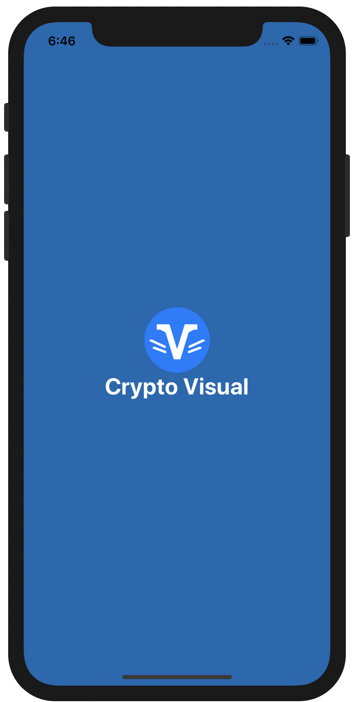
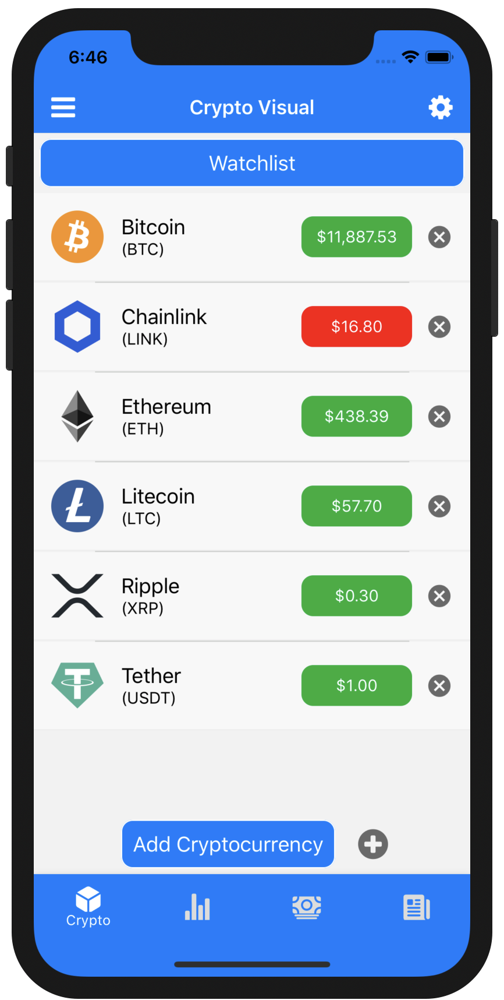
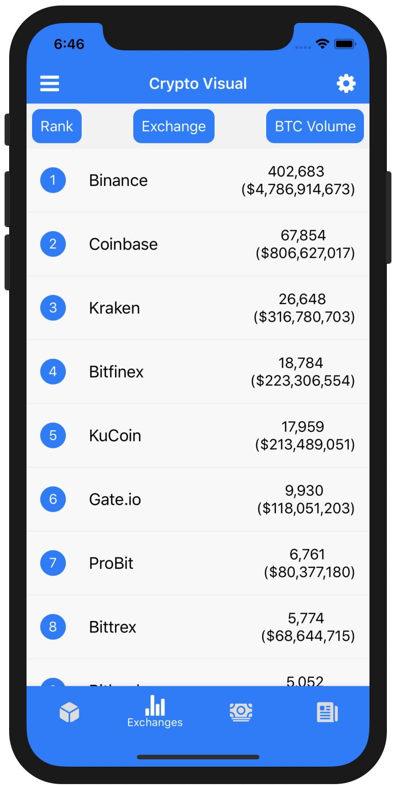
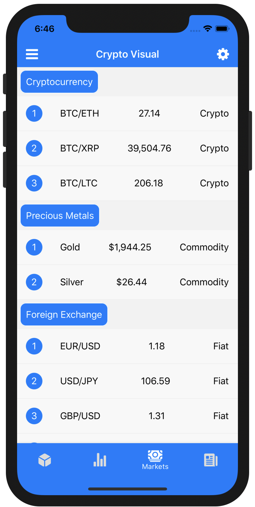

# 
__Crypto Visual__ 

  Crypto Visual is a mobile application that allows users to analyze the daily price movements and trading volumes of Cryptocurrency Markets and Exchanges.

  Crypto Visual is built using React Native, a popular mobile application framework that creates hybrid applications for both iOS and Android.

  Crypto Visual is a full stack application, using React Native components that create a user interface on the Frontend, and REST API calls that query databases on the Backend.

  Navigate the Cryptocurrency Markets with the power of Crypto Visual.

## __Cryptocurrency and Exchanges:__

   
  

Create a customizable watchlist of digital coins to track and monitor the price action of different cryptocurrencies.
  

  

Discover the world of 24/7 transactions by analyzing the trading volume of a wide selection of Cryptocurrency Exchanges.
  

## __Markets and News:__

 

  

Explore the Foreign Exchange and Commodities Markets to gain valuable insights into the price movements of currency pairs and precious metals.
  

  

Catch up on the latest Cryptocurrency News by reading research articles on the global economic factors driving the world of digital assets.
  

## __React Native__:

  React Native is an open-source framework for developing iOS and Android mobile applications. React Native allows 
  developers to use the React along with native platform capabilities to create mobile applications for multiple different mobile operating systems.
  React Native is a popular framework for developing hybrid mobile applications, allowing developers to use a single codebase in JavaScript for both iOS and  Android. In native mobile applications, developers must maintain two separate codebases, a Swift codebase for iOS and a Kotlin codebase for Android.
  

### Commands:
* $ npm start --reset-cache
* $ react-native run-ios
* $ react-native run-android
 

## __Xcode__:

### Swift

  Swift is a multi-paradigm, compiled programming language developed for iOS. Swift is designed to work with Apple's Cocoa and Cocoa Touch frameworks. Swift also extends the Objective-C code previously written for iOS devices. Crypto Visual uses Swift to transition from native iOS to React Native through the implementation of splash screens and animations.

### iOS Simulators
  * iPhone 11 Pro (13.6)
  * iPad Pro (11-inch) (13.6)
  * iPhone SE (13.6)
 

## __Android Studio:__

### Kotlin

  Kotlin is a cross-platform, statically typed programming language developed for Android. Kotlin is designed to interoperate fully with Java, and the JVM version of its standard library depends on the Java Class Library. Crypto Visual uses Kotlin to transition from native Android to React Native through the implementation of splash screens and animations.

### Android Virtual Devices
  * Pixel 3A API 30
  * Pixel C API 30
  * Nexus 9 API 30

 

## __Downloads:__

(Available for iOS and Android)

